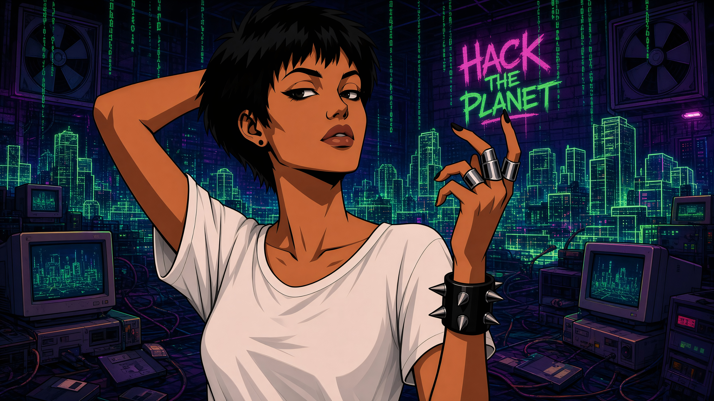
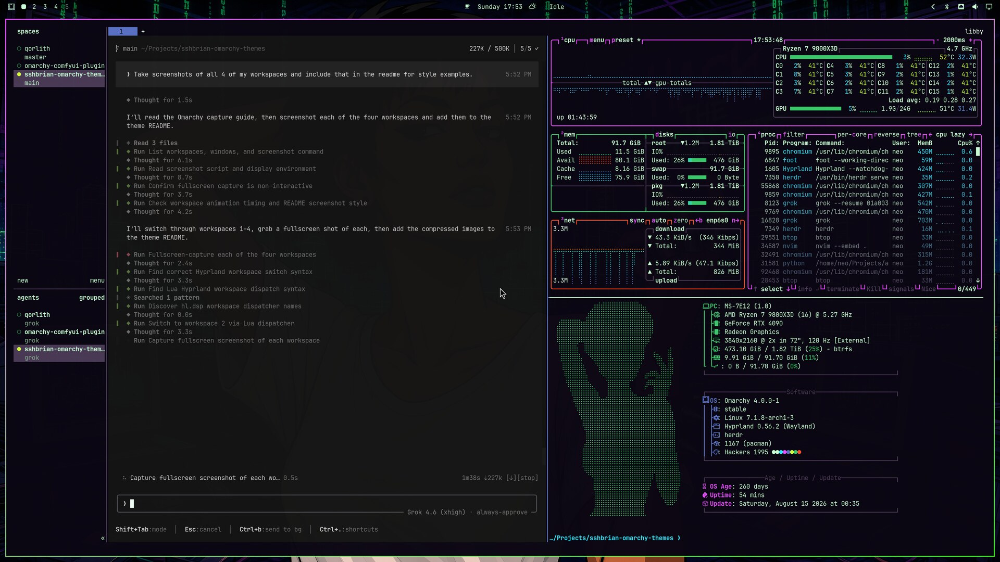
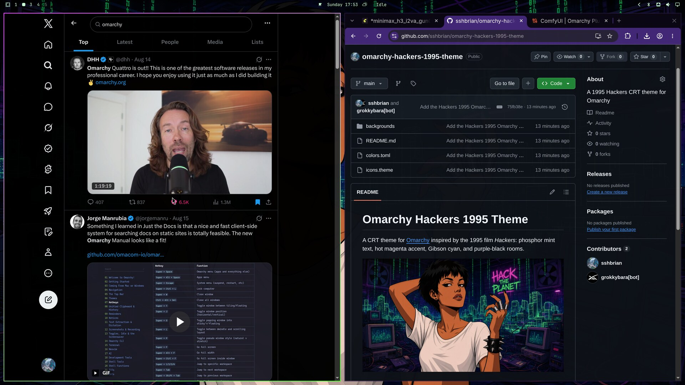
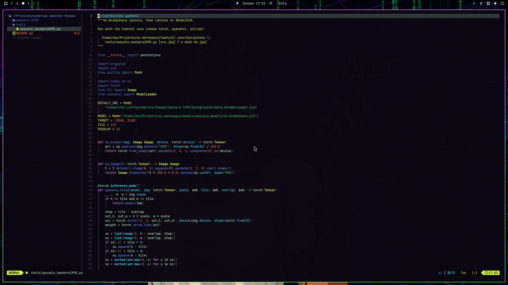
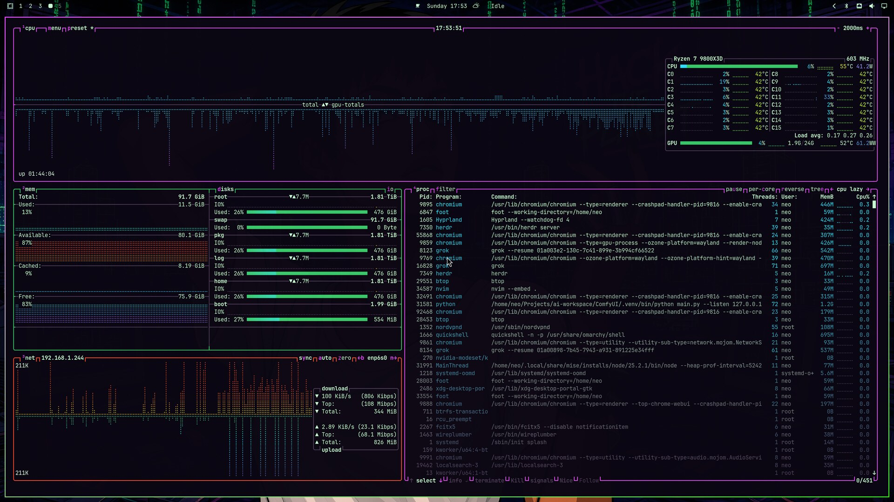

# Omarchy Hackers 1995 Theme

A CRT theme for [Omarchy](https://omarchy.org) inspired by the 1995 film *Hackers*: phosphor mint text, hot magenta accent, Gibson cyan, and purple-black rooms.



## Style

Four workspaces on the theme:

**Workspace 1** — Grok, btop, fastfetch



**Workspace 2** — Browser



**Workspace 3** — Neovim



**Workspace 4** — btop



## Install

```bash
omarchy theme install https://github.com/sshbrian/omarchy-hackers-1995-theme
```

## Palette

| Role | Hex |
| --- | --- |
| Background | `#0a0612` |
| Dark background | `#050208` |
| Darker background | `#020104` |
| Lighter background | `#1a1028` |
| Foreground | `#c8ffd4` |
| Accent | `#e84cff` |
| Selection | `#39c96a` |
| Muted | `#4a3a55` |

Full ANSI palette in [`colors.toml`](colors.toml). Icons are `Yaru-magenta`.
